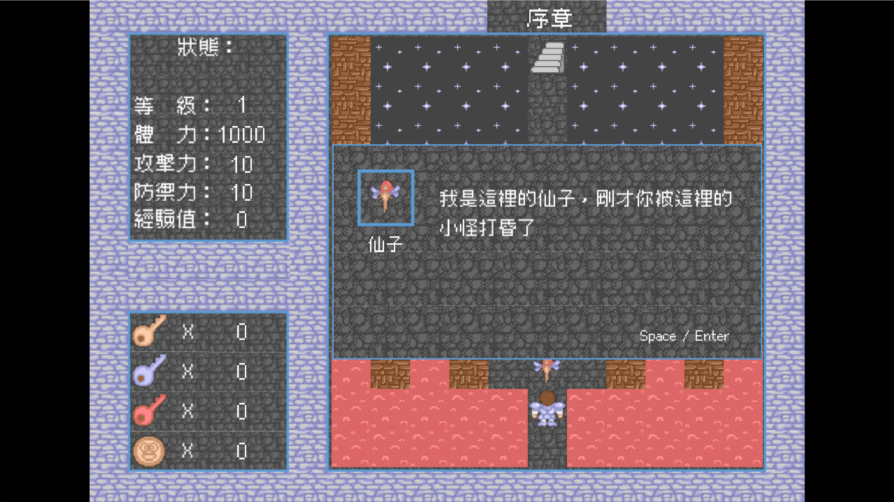
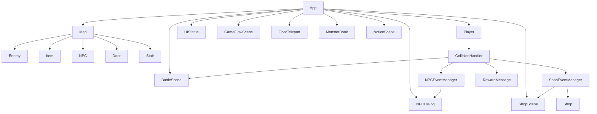

# 2026 OOPL Final Report

## 組別資訊

- 組別：第35組
- 組員：電資三 112820023 王承惠
- 復刻遊戲：魔塔 v1.12

## 專案簡介

### 遊戲簡介

- 《魔塔》是一款經典的 2D 策略 RPG 遊戲，玩家扮演一名勇者，目標是爬上擁有不同配置的塔頂救出公主。
- 不同於傳統 RPG 的隨機戰鬥，魔塔的戰鬥結果是完全可預測的，因為玩家必須在有限的資源（血量、鑰匙、攻防數值）下， 精密計算戰鬥損耗，決定升級順序，以最小傷害打通魔塔救出公主。
- 本專案以 PTSD 框架實作《魔塔 v1.12》的主要遊戲流程，包含玩家移動、樓層探索、道具取得、怪物戰鬥、NPC 對話、商店交易、樓層飛升、怪物手冊、片頭與片尾等系統。實作時盡量將不同功能拆分成獨立類別，讓地圖、玩家、戰鬥、NPC、商店與遊戲流程各自負責自己的邏輯。

### 組別分工
- 由我一人完成

## 遊戲介紹

### 遊戲規則

- **基本操作**
  - Space / Enter：確認、對話、商店購買
  - 方向鍵：角色移動、選單選擇
  - R: 重新開始
  - ESC：離開遊戲
  - N：開啟 / 關閉按鍵說明
  - J：開啟 / 關閉樓層飛升
  - L：開啟 / 關閉怪物手冊


- **探索規則**
  - 玩家在 11x11 的地圖中探索不同樓層
  - 碰到牆壁或不可通行物件時無法前進
  - 碰到樓梯會切換樓層，並出現在新樓層樓梯附近可站立的位置
  - 碰到不同顏色的門，要用相對應顏色的鑰匙才能開啟

- **戰鬥規則**
  - 玩家碰到怪物後會進入戰鬥畫面
  - 若能擊敗怪物，怪物會消失，玩家獲得金幣與經驗
  - 部分怪物具有特殊能力，例如初級巫師、高級巫師、白衣武士與靈法師會在戰鬥前造成額外傷害

- **道具規則**
  - 玩家碰到道具後會取得道具，道具消失後玩家才能走到該格
  - 道具可能增加生命、攻擊、防禦、鑰匙或開啟特殊功能

- **NPC 對話**
  - 玩家碰到 NPC 後會開啟對話框
  - 部分 NPC 對話結束後會觸發事件，例如給予獎勵、開路或出現樓梯

- **商店購物**
  - 玩家碰到商店 NPC 後會進入商店畫面
  - 商店可使用金幣或經驗購買能力提升或道具
  - 上下鍵移動選項指標
  - 按 SPACE/ENTER 確認選擇

- **特殊功能**
  - 取得風之羅盤後，可以使用樓層飛升，自由飛往去過的樓層
    - 按 J 可以開啟/關閉功能
    - 上下鍵選擇樓層
    - SPACE/ENTER 確認選項
  - 取得聖光徽後，可以查看目前樓層怪物基本情況及能力
    - 按 L 可以開啟/關閉功能
    - 左右鍵切換頁面

### DebugMode 測試模式

為了方便測試不同樓層、劇情事件、商店、戰鬥與結局流程，本專案在 `App.cpp` 中設計了 DebugMode。開啟後可以跳過登入畫面、Loading 與片頭動畫，直接進入指定樓層與指定座標，減少每次測試都要從第一層重新遊玩的時間。

DebugMode 主要可調整的項目如下：

| 設定項目 | 功能 |
|---|---|
| `kDebugMode` | 是否啟用測試模式 |
| `kDebugLevel` | 指定起始樓層 |
| `kDebugSpawnRow` / `kDebugSpawnCol` | 指定勇者起始格子座標 |
| `kDebugOverridePlayerStats` | 是否覆蓋勇者初始能力值 |
| `kDebugHp` / `kDebugAtk` / `kDebugDef` | 指定勇者血量、攻擊力、防禦力 |
| `kDebugExp` / `kDebugCoin` | 指定勇者經驗值與金幣 |
| `kDebugYellowKeys` / `kDebugBlueKeys` / `kDebugRedKeys` | 指定三種鑰匙數量 |
| `kDebugHasWindCompass` | 是否一開始取得風之羅盤，用來測試樓層飛升 |
| `kDebugHasMonsterBook` | 是否一開始取得怪物手冊 |
| `kDebugOverrideMaxReachedFloor` / `kDebugMaxReachedFloor` | 指定樓層飛升可到達的最高樓層 |
| `kDebugReleaseFinalSeal` | 是否解除最終封印，用來測試血影與結局 |

正式執行時只需要將：

```cpp
const bool kDebugMode = false;
```

### 遊戲畫面

|    階段    |                        遊戲畫面                        |
|:--------:|:--------------------------------------------------:|
|   登入畫面   |      |
|   片頭畫面   |      |
|   地圖探索   |      |
|  NPC 對話  |     |
|   商店畫面   |      |
|   戰鬥畫面   |      |
|   獎勵提示   |      |
|   樓層飛升   |      |
|   怪物手冊   |      |
| 最終BOSS魔龍 |  |
|  失敗結束畫面  |    |
| 最終BOSS血影 |  |
|  勝利結束畫面  |    |
|   片尾畫面   |      |

## 程式設計

### 程式架構



| 類別               | 系統分類     | 負責內容                                                                                       |
|------------------|----------|--------------------------------------------------------------------------------------------|
| App              | 遊戲主流程    | 負責遊戲初始化、Update / Draw 流程、管理 Map、Player、BattleScene、NPCDialog、ShopScene、GameFlowScene 等主要系統 |
| BackgroundImage  | 基礎繪圖物件   | 封裝圖片載入、位置、縮放與繪製，作為地圖物件、道具、怪物、NPC 等圖片物件的基礎                                                  |
| Character        | 角色基礎類別   | 定義角色共通概念，例如方向、位置與基本角色狀態，作為角色系統的基礎設計                                                        |
| Player           | 玩家系統     | 管理勇者的位置、移動方向、能力值、鑰匙、金幣、經驗與特殊道具狀態，並處理玩家更新流程                                                 |
| Map              | 地圖系統     | 負責載入與繪製樓層地圖、道具、怪物與 NPC，並管理目前樓層、特殊樓層、門與地圖格子的狀態                                              |
| Door             | 地圖互動     | 管理不同種類門的圖片與開門動畫，包含黃門、藍門、紅門、綠門與柵欄門                                                          |
| Stair            | 樓層系統     | 負責玩家踩到樓梯後的樓層切換，並將玩家放到新樓層樓梯附近可站立的位置。特殊樓層分支也由此處處理                                            |
| Item             | 道具系統     | 管理道具種類、圖片與取得後的效果，例如鑰匙、藥水、寶石、裝備與特殊道具                                                        |
| Enemy            | 怪物系統     | 管理怪物種類、能力值、金幣與經驗獎勵、圖片動畫，以及不同樓層怪物的特殊能力變化                                                    |
| NPC              | NPC 系統   | 表示地圖上的 NPC 物件，包含 NPC 類型、位置與圖片顯示                                                            |
| NPCDialog        | 對話系統     | 負責 NPC 對話框、文字換行、說話者名稱、頭像顯示與頭像動畫                                                            |
| NPCEventManager  | NPC 事件管理 | 依照不同 NPC 類型觸發對應事件，例如仙子給鑰匙、小偷開路、公主開樓梯、長者給獎勵等                                                |
| Shop             | 商店資料與交易  | 儲存商店標題、對話、商品列表、花費類型與購買邏輯，負責判斷交易是否成功                                                        |
| ShopScene        | 商店畫面     | 負責商店 UI、選項切換、確認購買、商店頭像動畫與交易後訊息顯示                                                           |
| ShopEventManager | 商店事件管理   | 根據商店類型開啟不同商店，設定長者商店、商人商店、金幣商店等內容                                                           |
| Battle           | 戰鬥計算     | 負責計算玩家與怪物的戰鬥結果，例如攻擊次數、預估傷害、是否能擊敗怪物等                                                        |
| BattleScene      | 戰鬥畫面     | 負責戰鬥視窗、玩家與怪物數值顯示、戰鬥流程播放、勝利後獎勵與擊殺判斷                                                         |
| CollisionHandler | 碰撞系統     | 統一處理玩家移動時碰到不同物件的反應，例如牆壁、門、道具、怪物、NPC、商店與樓梯                                                  |
| RewardMessage    | 獎勵提示     | 負責顯示獎勵橫幅，例如取得道具、能力提升、擊敗怪物獲得金幣與經驗                                                           |
| FloorTeleport    | 樓層飛升     | 負責風之羅盤功能，讓玩家選擇已到達樓層並傳送到該樓層樓梯附近                                                             |
| MonsterBook      | 怪物手冊     | 顯示目前樓層存在的怪物資料，包含生命、攻擊、防禦、經驗、金幣與預估傷害                                                        |
| NoticeScene      | 按鍵提醒畫面   | 負責顯示操作說明畫面，使用黑色背景列出一般按鍵與特殊按鍵，例如移動、確認、重新開始、樓層飛升與怪物清單                                        |
| GameFlowScene    | 遊戲流程畫面   | 管理登入畫面、Loading 畫面、片頭文字滾動、遊戲開始與片尾播放流程                                                       |
| TextObject       | 文字系統     | 封裝文字內容、字型大小、位置與繪製邏輯，供 UI、對話框、商店、戰鬥畫面與片頭片尾共用                                                |
| UIStatus         | 狀態欄 UI   | 負責左側狀態欄顯示與更新，包含等級、生命、攻擊、防禦、金幣、經驗、鑰匙數量與目前樓層                                                 |

### 程式技術

- **資料與程式分離**
  - 地圖、道具、怪物與 NPC 分布使用文字檔管理，讓樓層資料不需要直接寫死在程式中

- **碰撞流程控制**
  - 使用 CollisionHandler 統一處理玩家碰撞牆壁、門、道具、怪物、NPC、商店與樓梯的邏輯

- **戰鬥系統**
  - Battle 負責計算戰鬥結果，BattleScene 負責顯示戰鬥畫面與處理勝利後獎勵

- **NPC 事件系統**
  - NPC 本身只代表地圖上的角色，NPCEventManager 負責依照 NPC 類型觸發不同劇情事件

- **商店系統**
  - Shop 負責商品與交易邏輯，ShopScene 負責商店 UI，ShopEventManager 負責開啟不同商店

- **遊戲流程管理**
  - GameFlowScene 管理登入畫面、Loading、片頭與片尾，讓遊戲流程與地圖探索邏輯分離

- **Debug Mode**
  - App 中設計 Debug start settings，可以指定起始樓層與玩家位置，方便測試商店、NPC、Boss 與結局

### 使用到 AI/AI Agent 的部分

本專案開發過程中使用 AI Agent 輔助進行程式除錯、架構討論與報告內容整理，AI 主要協助分析碰撞流程、NPC 與商店的物件導向拆分、UI 顯示問題、特殊樓層規則與 Debug mode 設計，而實際程式整合、測試與功能取捨仍由我進行確認。

## 結語

### 問題與解決方法

| 問題               | 解決方法                               |
|------------------|------------------------------------|
| 玩家碰到怪物後會與怪物重疊    | 改成先進入戰鬥，戰鬥勝利後移除怪物，再讓玩家走到原本位置       |
| 玩家取得道具時會與道具重疊    | 取得道具後先移除道具，再更新玩家位置                 |
| 商店購買後左側狀態欄不會即時更新 | 在商店畫面更新後立即呼叫 UI 更新                 |
| 樓層切換時玩家先出現、地圖慢一拍 | 調整 Update / Draw 順序，先更新樓層與玩家，再繪製畫面 |

### 自評

| 項次   | 項目                      | 完成  |
|------|-------------------------|-----|
| 1    | 這是範例                    | V   |
| 2    | 完成專案權限改為 public         | V   |
| 3    | 具有 debug mode 的功能       | V   |
| 4    | 解決專案上所有 Memory Leak 的問題 | V   |
| 5    | 報告中沒有任何錯字，以及沒有任何一項遺漏    | V   |
| 6    | 報告至少保持基本的美感，人類可讀        | V   |

### 心得
- 在課程開始前，對於這堂課其實感到非常的擔憂及害怕，我害怕自己沒有能力可以完成一個專案，因為整個架構、邏輯、遊戲流程都需要自己規劃，
甚至於我玩過的遊戲不多，也不確定自己應該要復刻什麼樣的遊戲，不過還好有兩位助教給我想法，我也非常感謝許景喬助教的協助，讓我節省很多前期的工作量。
- 魔塔這個遊戲比想像中更有魅力，是會玩上癮的遊戲，不過我到後期才發現我復刻的版本超舊，而我會選擇1.12的版本只是因為我一開始查到的影片是1.12的破關功略，
所以我整個規劃跟一開始地圖的設置都是透過那個影片去完成的，到後期想要修改版本已經來不及了。
- 在開發過程中，我也學到遊戲程式很重視流程順序與狀態管理，像是玩家碰到怪物後，必須先進入戰鬥流程，戰鬥勝利後怪物才會消失；取得道具時，也要先觸發道具效果與提示，再讓玩家移動到該格，
而這些細節讓我理解到，程式能執行只是第一步，真正困難的是讓整個流程符合玩家預期，此外，這次專案也讓我更重視 UI 與使用者體驗，像是對話框的位置、文字換行、商店選單、怪物清單與按鍵提醒等，
雖然這些並不是核心邏輯，但會直接影響遊戲是否容易理解與操作，整體來說，這次專案讓我更熟悉 C++ 的物件導向設計，也讓我學會如何從功能需求出發，逐步整理出較完整且可維護的程式架構。
### 貢獻比例
|      組員       | 貢獻度  |
|:-------------:|:----:|
| 112820023 王承惠 | 100% |
